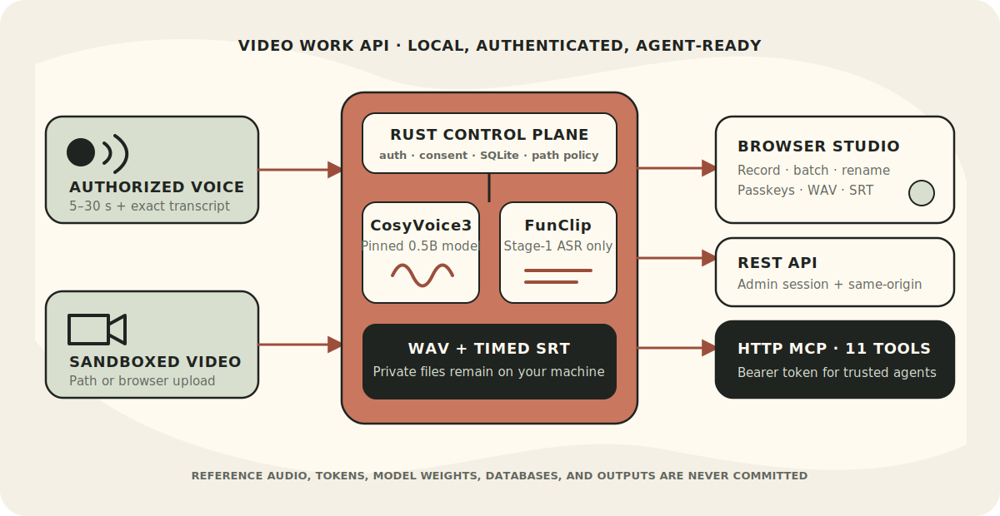

<div align="center">

# Video Work API

**A self-hosted voice and subtitle workspace for people, applications, and AI agents.**

Authorized zero-shot voice cloning with CosyVoice3, time-coded video subtitles
with FunClip, and a browser studio—served by one authenticated Rust service.

[English](README.md) · [简体中文](README.zh-CN.md)

[](LICENSE)
[](Cargo.toml)
[](#requirements)
[](https://aur.archlinux.org/packages/video-work-api-git)
[](#rest-api-and-http-mcp)

[Quick start](#quick-start) · [Highlights](#why-video-work-api) · [MCP tools](#the-11-mcp-tools) · [Security](#security-and-responsible-use) · [Contributing](CONTRIBUTING.md)

</div>



> [!IMPORTANT]
> Clone or publish a voice only with the identifiable speaker's explicit,
> informed permission. Voice cloning can enable impersonation and fraud. Read
> the [security and responsible-use policy](SECURITY.md) before importing audio.

## Why Video Work API?

- **One private workspace, three ways to use it.** Work in the bilingual web
  studio, integrate the session-authenticated REST API, or give a trusted AI
  agent 11 bearer-authenticated MCP tools.
- **Voice references become reusable assets.** Organize clips by speaker and
  style, rename them as a library evolves, and generate individual WAV files
  from one or many lines of text.
- **Video to usable SRT in the same service.** Submit sandboxed paths or browser
  uploads and receive time-coded segments plus a downloadable SRT file.
- **Built around consent and local ownership.** Exact transcripts, explicit
  rights confirmation, private tokens, and path sandboxes are enforced rather
  than left to client convention.
- **Useful with or without an agent.** It is a practical local studio first;
  MCP adds automation without replacing the browser workflow.

## What can I use it for?

| Use case | What Video Work API provides |
|---|---|
| Authorized creator voiceovers | Reuse distinct speaking styles and generate downloadable WAV files |
| Localization and accessibility | Produce draft narration and time-coded SRT subtitles locally |
| Private media workflows | Keep references, outputs, metadata, and model files on your own machine |
| Agent-assisted production | Let Codex or another MCP client list voices, generate speech, and extract subtitles |
| Small-team voice libraries | Manage speakers and profiles in a bilingual, password-protected browser studio |

This project is deliberately focused: it does not edit video, translate
subtitles, perform FunClip stage-2 clipping, or make consent decisions for you.

## How it works

The Rust service owns authentication, metadata, consent checks, filesystem
boundaries, and publication. Python helpers are used only for the vendored
CosyVoice and FunClip inference runtimes.

1. Add an authorized 5–30 second reference clip and its exact transcript, or
   place/upload a video inside the allowed input boundary.
2. CosyVoice3 generates speech from a selected profile; FunClip **stage-1 ASR
   only** produces time-coded subtitle segments and SRT.
3. Use the result through the browser studio, authenticated REST API, or HTTP
   MCP. Generated audio is returned as a local path to agents, never base64.

## Quick start

### Arch Linux (AUR)

[`video-work-api-git`](https://aur.archlinux.org/packages/video-work-api-git)
builds the current Git revision and installs the service layout.

```bash
paru -S video-work-api-git
sudo vwactl setup
sudo vwactl init
sudo vwactl model download   # opt-in, roughly 10 GB network + disk
sudo systemctl start video-work-api.service
```

Open `http://localhost:7860` and finish setup with the one-time token printed by
`sudo vwactl init`. The package installs the systemd unit but **does not enable
or start it automatically** and does not change firewall rules.

### Build from source

```bash
git clone --recurse-submodules https://github.com/LIghtJUNction/video-work-api.git
cd video-work-api
cargo build --release
./scripts/vwactl setup
./scripts/vwactl init
./scripts/vwactl model download   # opt-in, roughly 10 GB network + disk
./scripts/vwactl serve
```

Then open `http://localhost:7860`. `setup` creates a Python virtual environment
for the inference runtimes; the API server itself is the Rust `vwactl` binary.

<details>
<summary><strong>First login, model download, and passkeys</strong></summary>

`vwactl init` creates private data directories, SQLite state, a persistent
mode-0600 MCP token, and a one-time web setup token. Use the setup token to
create an administrator password of at least 12 characters. The model download
is fixed to the repository and revision listed below, reuses the Hugging Face
Hub cache, and requires the `hf` CLI.

After password login, you can register a passkey. WebAuthn requires an HTTPS
domain, except for `http://localhost:<port>` during local development; literal
IP origins are not supported. The administrator password remains a recovery
login. Reset it interactively with `./scripts/vwactl passwd` (source) or
`sudo vwactl passwd` (package).

</details>

## Browser studio

The English/Chinese studio provides:

- one-time setup, administrator sessions, and optional passkey login;
- speaker and voice-profile creation, rename, and guarded deletion;
- browser microphone recording or audio upload with exact transcript and
  explicit consent confirmation;
- batch speech generation (one WAV per non-empty line), playback, retry, and
  human-readable downloads;
- batch subtitle extraction from sandboxed paths and local uploads (up to 2 GiB
  each), with progress, retry, preview, and SRT download;
- authenticated model-download status and a **Copy agent prompt** flow for
  configuring Codex or Claude Code without exposing the token before login.

Microphone capture requires a secure browser context: HTTPS or localhost.

## REST API and HTTP MCP

These are intentionally separate trust paths:

| Interface | Intended client | Authentication | Browser origin policy |
|---|---|---|---|
| REST under `/api/*` | Web studio and application integrations | Public status, one-time setup, password login, and passkey-login entry points; authenticated endpoints use an opaque `HttpOnly`, `SameSite=Strict` admin session | Unsafe requests require the `Origin` host and port to match `Host` |
| HTTP MCP at `POST /mcp` | Trusted AI agents | `Authorization: Bearer <VWA_MCP_TOKEN>` | Bearer-authenticated MCP is exempt from browser same-origin checks |

REST covers setup, login/logout, passkeys, model download, speaker/profile
management, speech generation, authenticated WAV retrieval, and subtitle
extraction. See the live `/docs` page after starting the service for a compact
endpoint reference.

### The 11 MCP tools

| Tool | Purpose |
|---|---|
| `get_status` | Inspect service, model, FunClip, and MCP readiness |
| `list_speakers` | List speakers and their voice profiles |
| `create_speaker` | Create a speaker entry |
| `rename_speaker` | Rename a speaker while preserving uniqueness |
| `delete_speaker` | Delete a speaker only after its profiles are removed |
| `add_voice_profile` | Import sandboxed reference audio with exact transcript and `confirm_rights=true` |
| `rename_voice_profile` | Rename a profile style while preserving per-speaker uniqueness |
| `delete_voice_profile` | Delete a profile that has no generation history |
| `generate_speech` | Generate CosyVoice3 speech and return a generation ID/local audio path |
| `get_generation` | Read generation status and the completed audio path |
| `extract_video_subtitles` | Extract time-coded SRT data with FunClip stage-1 ASR |

After administrator login, **Copy agent prompt** provides setup instructions for
both Codex and Claude Code. Project scope uses `.codex/config.toml` for Codex or
`.mcp.json` for Claude Code; user/global scope uses each client's user-level MCP
configuration. Treat every resulting configuration as a secret because it
contains the static bearer token.

<details>
<summary><strong>MCP token lifecycle</strong></summary>

The token persists across restarts and upgrades at
`$VWA_DATA_DIR/mcp-token` unless `VWA_MCP_TOKEN_FILE` changes it;
`VWA_MCP_TOKEN` is a higher-priority compatibility override. Rotate deliberately
with `vwactl mcp-token rotate`, restart the service, sign in, copy the new agent
prompt, replace the client's configuration, then restart or open a new client
session and verify the live tools. A restart alone cannot update a client's
static header.

</details>

## Requirements

- Linux, **Rust 1.88+**, Python 3.10+, `uv`, FFmpeg, SoX, Git LFS, and the
  Hugging Face CLI (`hf`, provided for example by `python-huggingface-hub`)
- NVIDIA CUDA recommended for CosyVoice inference; CPU works but is slow
- Roughly 10 GB of network and disk capacity for the pinned CosyVoice3 snapshot
  and runtime environment
- Additional FunASR models downloaded on first subtitle extraction

### Fixed model and runtime scope

- Voice model: [`FunAudioLLM/Fun-CosyVoice3-0.5B-2512`](https://huggingface.co/FunAudioLLM/Fun-CosyVoice3-0.5B-2512)
- Revision: `29e01c4e8d000f4bcd70751be16fa94bf3d85a18`
- Inference runtime: vendored [`FunAudioLLM/CosyVoice`](https://github.com/FunAudioLLM/CosyVoice) (CosyVoice3, not Qwen3-TTS)
- Subtitles: vendored [`modelscope/FunClip`](https://github.com/modelscope/FunClip), stage-1 FunASR Paraformer only

## Security and responsible use

- Obtain explicit, informed permission for the voice and its intended use.
- Preserve the exact reference transcript; do not bypass `confirm_rights`.
- Keep voices, transcripts, generated media, SQLite data, tokens, credentials,
  model weights, caches, and environment files out of Git.
- MCP reference audio and videos are restricted to their configured input
  directories; symlinks and unsafe paths are rejected.
- The default `0.0.0.0:7860` bind is LAN-visible. For untrusted networks, bind
  to loopback or use an authenticated HTTPS reverse proxy and trusted-subnet
  filtering. Never expose this service directly to the public Internet.
- Installation does not enable the service or modify firewall rules.

Read [SECURITY.md](SECURITY.md) for the full threat model and reporting path.

<details>
<summary><strong>Configuration and installed paths</strong></summary>

Configuration uses the `VWA_*` prefix. Common settings include
`VWA_DATA_DIR`, `VWA_MODEL_DIR`, `VWA_COSYVOICE_ROOT`, `VWA_FUNCLIP_ROOT`,
`VWA_HOST`, `VWA_PORT`, `VWA_VIDEO_INPUT_DIR`, `VWA_REFERENCE_INPUT_DIR`,
`VWA_MCP_TOKEN_FILE`, and optional `VWA_SSL_CERTFILE` / `VWA_SSL_KEYFILE`.
See [`config.env.example`](config.env.example) for the authoritative defaults.

Packaged paths:

| Purpose | Path |
|---|---|
| Application | `/usr/lib/video-work-api` |
| Configuration | `/etc/video-work-api/config.env` |
| Private data | `/var/lib/video-work-api` |
| Service | `video-work-api.service` |

Use `vwactl paths` and `vwactl status` to inspect the effective source-install
configuration. Use `systemctl start`, `stop`, or `restart` explicitly for the
packaged unit; do not assume it is enabled.

</details>

## Project layout

```text
src/                 Rust library and vwactl service/CLI
scripts/             Setup wrapper and inference helpers
static/              Bilingual browser studio and assets
vendor/              CosyVoice and FunClip submodules
systemd/             Packaged service unit
packaging/aur/       AUR VCS package files
tests/               API, CLI, and browser-contract tests
```

## Documentation and development

- [Security and responsible use](SECURITY.md)
- [Configuration example](config.env.example)
- [Packaging and AUR notes](packaging/README.md)
- [Contributing guide](CONTRIBUTING.md)
- Live API reference: `/docs` on a running instance

```bash
cargo test
cargo build --release
bash -n scripts/vwactl .agents/skills/video-work-api/scripts/health-check.sh
```

Tests use fake inference and temporary directories; they do not require model
downloads. Please keep English and Simplified Chinese README sections in sync.

## License

Video Work API is licensed under [Apache License 2.0](LICENSE). Vendored model
code and model artifacts retain their respective upstream licenses and terms.
